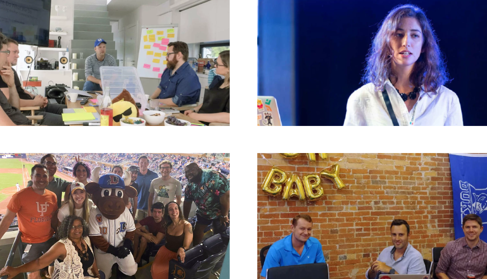

# Join us: our mission is to disrupt commerce

> We are commercetools, the world’s leading digital commerce platform that allows global companies to create powerful, highly customized commerce experiences while building profitable, sustainable brands.

  

Our mission is to **disrupt the digital commerce industry**. We are challenging and changing the world of enterprise commerce software. By enabling brands to cross the Commerce Possibilities Chasm (TM), every new communications channel becomes a commerce possibility - from in-car, video content and A/R, voice, and IoT-enabled machines, to the devices of the future that we can only now imagine.

We are a **passionate bunch of coders, marketers and thought leaders, but we are also amateur gourmet cooks, marathon enthusiasts, and stand-up comedians**! At commercetools, our differences really are the fuel of our teamwork. We are bonded by a clear company vision and a well-defined value compass.

**🔍 Check out our [open positions](https://commercetools.com/careers/jobs)**

  

## At commercetools you will:

1. Have a lot of **autonomy** and be at the forefront of **building a cutting edge platform** that helps millions of people every day
2. Push code to **production within your first two weeks** and not deal with big company bureaucracy
3. Work on complex speed and **scaling challenges** as we expand to a global audience
4. Take full responsibility for **developing new features** and making sure it meets users expectations

## Our Tech Stack

We were early adopters of many technologies such as React, GraphQL or Scala. We enjoy **contributing back to Open Source and financially support many projects** across the stack such as Typelevel Cats, msw, Rollup, Let's Encrypt, Scala or Vale. Our [tech blog](https://techblog.commercetools.com/) might have some interesting posts for you.

### Frontend

We are proud **early user of React** and use it to build most of our frontend applications. We use both our **public commercetools APIs** as well as **internal GraphQL APIs** in our several independently deployed frontends. The building blocks of our internal APIs are **Prisma, Apollo Server**, and Express. With a focus on software quality by using **TypeScript** and testing frameworks such as **React Testing Library and Cypress** we automatically **deploy daily into multiple Kubernetes clusters**.

### Backend

Our product’s **high-performing backend** is written in **functional Scala and has Event Sourcing** as its core. This allows us to add new components, react to events, and use data in the most relevant ways. On the client-facing side, we present the best APIs, embracing **CQRS and GraphQL** to allow our customers to work in the most intuitive, flexible and modern ways possible.

### Infrastructure

We are **multi-cloud**: commercetools runs on **Google Cloud Platform** and **AWS** in multiple regions across the world. All services are running on various Kubernetes clusters with the help of toolings from CNCF landscape: Prometheus, **Envoy** (within Istio), **Helm**, and Fluentd. tools include **Terraform**, Packer as well as **Vault** from HashiCorp. We run our CI/CD jobs on Google Cloud Builder while in-house automation is written in Python and **Golang**.

**🔍 Check out our [open positions](https://commercetools.com/careers/jobs)**

## Our offices

  

We have [offices](https://commercetools.com/offices) around the world and value flexibility. You can work from **one our our offices** but also **remotely from many locations** across the world depending on the role.

We care about **your growth** and well-being with different benefits depending on your location.

- ☀️ **Remote Work**: Up to 60 days/year from a country different from your base country
- 💻 Open learning & **development budget**
- 📚 ct Academy: regular **internal training sessions**
- ⌚️ Flexibility: morning person or night owl? We believe in outcome and motivated employees
- 🚀 Mindset & Growth: A **diverse, creative workspace** with an international culture & learning environment
- ⌨️ **High-end hardware** with external screen and Mac

Sounds interesting? Check out our [career page](https://commercetools.com/careers) and our website for more information.
